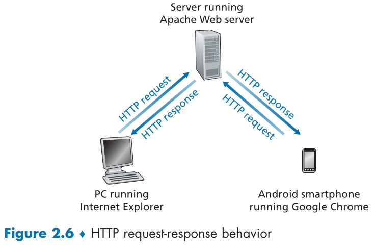
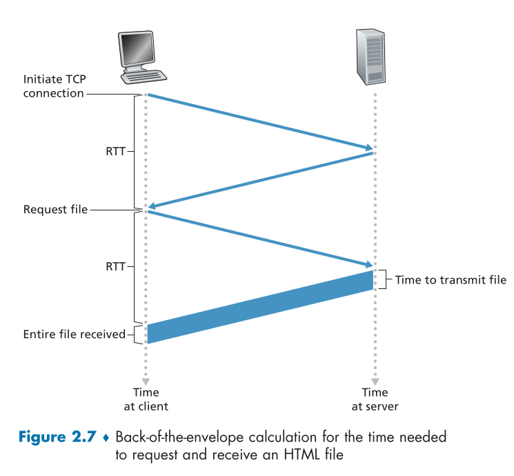
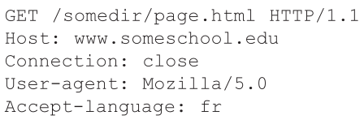
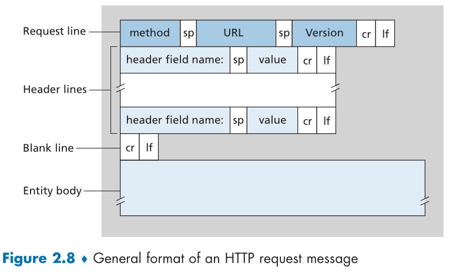
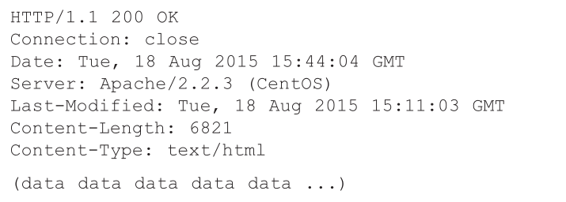
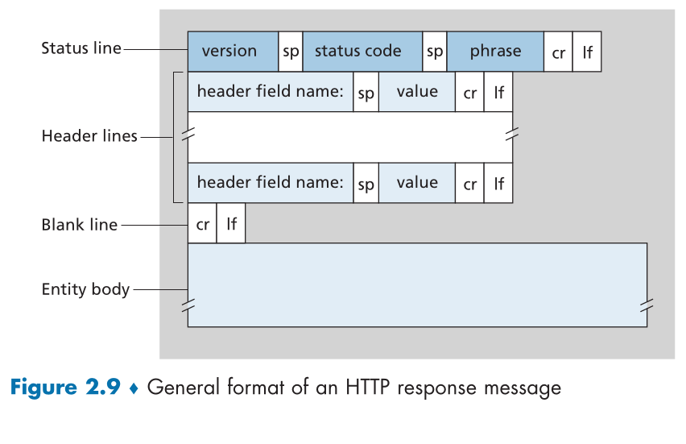
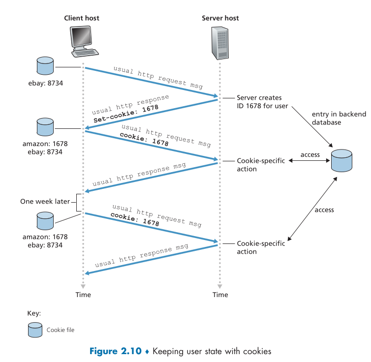
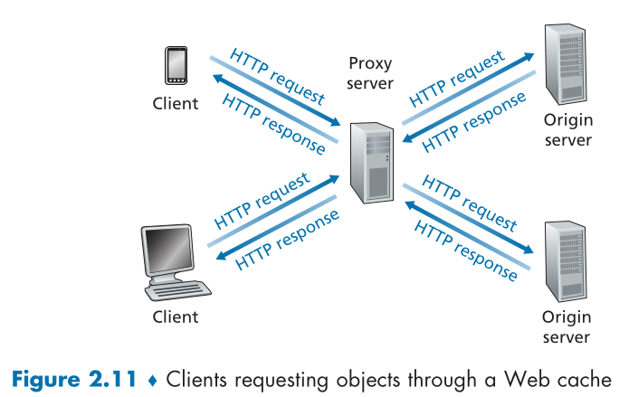

- ## 2.2.1 Overview of HTTP
	- The HTTP is defined in [RFC 1945](https://datatracker.ietf.org/doc/html/rfc1945), [RFC 7230](https://datatracker.ietf.org/doc/html/rfc7230) and [RFC 7540](https://datatracker.ietf.org/doc/html/rfc7540)
	- HTTP is implemented in two programs: a cliente and a server program, executing on differets end systems, talking to each other bt exchanginf HTTP messages (figure 2.6).
	- HTTP uses TCP as its underlying transport protocol, TCP provides a reliable data transfer service to HTTP, ensuring that HTTP messages are successfully transmitted between the client and the server without loss or corruption. The layered architecture allows each protocol to focus on its specific responsibilities, leading to a more efficient and modular design.
	- HTTP is stateless, meaning it doesn't store client request information. If a client requests the same object within a short period, the server doesn't recognize the previous request. It responds by resending the object, unaware that it had previously served it.
	- HTTP default por number is 80
	
    

---
- ## 2.2.2 Non-Persistent and Persistent Connections
	- HTTP can use both non-persistent and persistent connections, Although HTTP uses persistent connections as its default mode.
	- ### Non-Persistent Connections: 
		- Non-persistent connections close the TCP connection after the server sends the requested object, as implemented in HTTP/1.0.
		- Each non-persistent TCP connection transports exactly one request message and one response message.
		- Non-persistent connections have some shortcommings, for every brand new connection TCP buffers must be allocated and TCP variables must be kept in both client and server, and each object suffers a delivery dellay of two RTTs (round-trip time), one to establish the TCP connection and one to transport the object.
        
	- ### Persistent Connections:
		- With HTTP/1.1 the server leaves the TCP connection open after sending a response.
		- Requests for objects can be made back-to-back without waiting for replies to pendind requests (pipelining).
		- HTTP server closes a connection when it ins't used for a certain time (timeout interval)

---
- ## 2.2.3 HTTP Message Format
	- There are two types of HTTP messages, request and responde messages
	
	- ### HTTP Request Message
        
		- The message is written in ordinary ASCII text
		- every final line have a carriage return and a line feed, the last line have and addiotional carriage return and line feed
		- First line is called *request line*, the subsequents lines are called *header lines*
		- Request line has three fields: *method field*, *URL field*, and *HTTP version field*
		- Method field can take on several different values: *GET*, *POST*, *HEAD*, *PUT* and *DELETE*
		- Analysing header lines of the example:
			- **Host**: the URL specifies the host on which the object resides, this line in necessary to provide information for web proxy caches
			- **Connection**: *close*, the browser is telling the server thath it doesn't want to bother with persistent connections
			- **User-agente**: Browser type that is making the request to the server, it's useful because the server can actually send different versions of the same object to different types of user agents
			- **Accept-language**: Indicates that the user prefers to receita a French version of the object, if such object exists on the server, otherwise, the server should send its default version.

        

		- After the header lines, there is an "entity body," which is empty for the GET method but used for the POST method. When a user fills out a form, the POST method is commonly used, such as when entering search words into a search engine. In a POST request, the entity body contains the user's input from the form fields. However, it's worth noting that HTML forms can also use the GET method, where the inputted data is included in the requested URL. The HEAD method is similar to GET but excludes the requested object in the server's response, often used for debugging purposes. 
		- The PUT method allows users to upload objects to a specific path on a web server, commonly used with web publishing tools. The DELETE method enables users or applications to delete an object on a web server.
  
	- ### HTTP Response Message
        
		- The response message can be divided into three sections: the initial status line, six header lines, and the entity body. The entity body contains the requested object, represented by the data. The status line consists of the protocol version field, a status code, and a corresponding status message. In this example, the status line indicates that the server is using HTTP/1.1 and that the request is successful (everything is OK).
		- Analysing header lines of the example:
			- **Connection:** The "Connection: close" header line indicates that the server will close the TCP connection after sending the response. It informs the client about the connection behavior.
			- **Date**: The "Date" header line specifies the time and date when the HTTP response was generated and sent by the server. It indicates when the server processed the request and created the response.
			- **Server**: The "Server" header line identifies the software or server application that generated the response. In this case, it indicates that an Apache Web server handled the request.
			- **Last-Modified**: The "Last-Modified" header line indicates the time and date when the requested object was last modified on the server. It is essential for caching mechanisms to determine if the object has changed since the client's last request.
			- **Content-Length**: The "Content-Length" header line specifies the size of the object in bytes. It allows the client to determine the length of the entity body being transferred.
			- **Content-Type**: The "Content-Type" header line indicates the media type of the object in the entity body. It informs the client about the type of content being sent, in this case, HTML text.
         
--- 

- ## 2.2.5 User-Server Interaction: Cookies
	- Cookies are defines in [RFC 6265](https://datatracker.ietf.org/doc/html/rfc6265)
	- Allow sites to keep track of users
	- cookie has four components:
		1. a cookie header line in the HTTP response message
		2. a cookie header line in the HTTP request message
		3. a cookie file kept on the user's end system and managed by the user's browser
		4. a back-end database at the web site
     
--- 

- ### 2.2.5 Web Caching
	- also called a *proxy server*
	- the cache has its own disk storage and keeps copies of recently requested objects in this storage, it satisfies HTTP requests on the behalf of and origin server
	- defined in the [RFC 7234](https://www.rfc-editor.org/rfc/rfc7234)
     
	- a cache is both a server and a client at the same time. When it receives requests from and sends responses to a browser, it is a server. When it sends requests to and receives responses from an origin server, it is a client.
	- Typically a Web cache is purchased and installed by an ISP. For example, a university might install a cache on its campus network and configure all of the campus browsers to point to the cache.
	- Web caching reduces response time for client requests by delivering content quickly from caches with high-speed connections. It also minimizes traffic on institution access links, cutting costs and improving overall Internet performance.
	- HTTP has a mechanism called *conditional GET* [RFC 7232](https://datatracker.ietf.org/doc/html/rfc7232)that allows a cache to verify its objects are up to date. It works on top of a request header line ""*if-Modified-Since*".
	 ![[conditional_get_example.png]]

--- 
- ### 2.2.6 HTTP/2
	- HTTP/2 [RFC 7540](https://datatracker.ietf.org/doc/html/rfc7540) 
	- HTTP/2 improves latency with multiplexing over a single TCP connection, prioritization, server push, and header compression, without changing core HTTP elements.
	- One of the primary goals of HTTP/2 is to get rid of (or at least reduce the number of) parallel TCP connections for transporting a single Web page. This not only reduces the number of sockets that need to be open and maintained at servers, but also allows TCP congestion control to operate as intended. But with only one TCP connection to transport a Web page, HTTP/2 requires carefully designed mechanisms to avoid HOL blocking.
	- HTTP/2 addresses head-of-line (HOL) blocking by breaking down messages into smaller frames and interleaving request and response messages on the same TCP connection. This allows for concurrent processing of multiple requests and responses. The framing sub-layer in HTTP/2 is responsible for breaking messages into frames, with the header field as one frame and the body divided into additional frames. These frames are then interleaved on the server side and sent over the persistent TCP connection. On the client side, frames are reassembled into the original messages. This framing mechanism significantly reduces user-perceived delay. Additionally, the framing sub-layer binary encodes frames, making the protocol more efficient, with smaller frames and improved parsing capabilities.
	- When a client sends concurrent requests to a server, it can prioritize the responses it is requesting by assingning a weight between 1 and 256 to each message, the higher the number indicates higher priority.
	- HTTP/2 also have the ability to send multiple responses for a single client request, the server can push additional objects to the client, without the client having to request each one.

 
	
 
