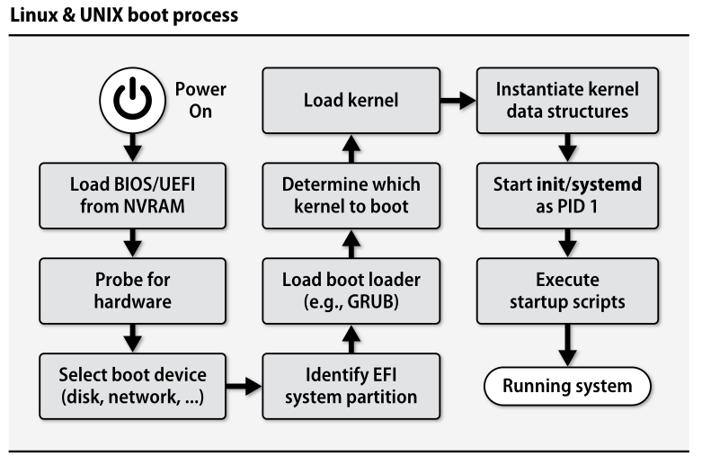
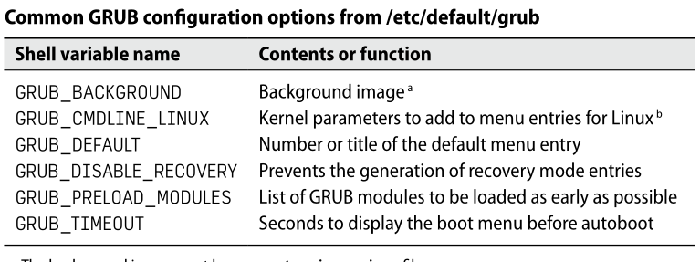
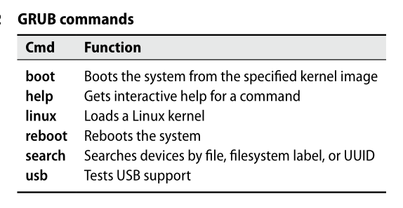

- The boot process consists of a few broadly defined tasks
	- Finding, loading, and running bootstrapping code 
	- Finding, loading, and running the OS kernel
	- Running startup scripts and system daemons
	- Maintaining process hygiene and managing system state transitions

- ## 2.1 Boot Process Overview		
	- 

	- UEFI (**U**nified **E**xtensible **F**irmware **I**nterface) simplified the early stages of the booting process, now the modern gnu-linux distribuitions uses *systemd* insted of UNIX init.
	- **systemd** streamlines the boot process by adding dependency management, support for concurrent startup process, comprehensive approach to logging, among other features.
	- the procedures for booting the system are managed for a series of shell scripts called "init scrips".
 
- ## 2.2 System Firmware
	- When a machine is powered on, the CPU is hardwired to execute boot code stored in ROM. On virtualized systems, this “ROM” may be imaginary, but the concept remains the same.
	- The system firmware is aware of the devices on the motherboard, including SATA controllers, network interfaces, USB controllers, and power/temperature sensors. It allows hardware-level configuration of these devices and provides options to expose them to the operating system or disable/hide them.
 
- ### BIOS vs UEFI
	- Traditional PC firmware was called the BIOS, for Basic Input/Output System. Over the last decade, however, BIOS has been supplanted by a more formalized and modern standard, the Unified Extensible Firmware Interface (UEFI). You’ll often see UEFI referred to as “UEFI BIOS”.
	- UEFI is the current revision of an earlier standard, **EFI**. References to the name EFI persist in some older documentation and even in some standard terms, such as "EFI system partition".
 
- ### Legacy BIOS
	- The traditional BIOS boot process involves the use of a Master Boot Record (MBR) located on the boot device. The MBR contains a small first-stage boot loader and a basic partitioning table.
	- The first-stage boot loader, also known as the boot block, is very small and has limited capabilities. It is responsible for locating and loading the second-stage boot loader.
	- The second-stage boot loader is stored either in the active disk partition or in the dead zone between the MBR and the first partition. It is more advanced and capable of understanding different operating systems and filesystems, once the second-stage boot loader is loaded, it takes over the boot process and loads the operating system into memory. To ensure a successful boot, all components of the boot chain, including the MBR boot block, second-stage loader, and operating system, must be properly installed and compatible with each other.
	- The MBR boot block is not specific to any particular operating system but assumes a specific location for the second-stage loader. This allows for the installation of multiple versions of the second-stage loader.
 
- ### UEFI
	- The UEFI specification includes a modern disk partitioning scheme known as GPT (GUID Partition Table, where GUID stands for “globally unique identifier”). UEFI also understands FAT (File Allocation Table) filesystems, a simple but functional layout that originated in MS-DOS. These features combine to define the concept of an EFI System Partition (ESP). At boot time, the firmware consults the GPT partition table to identify the ESP. It then reads the configured target application directly from a file in the ESP and executes it.
	- Because the ESP is mounted in generic FAT it can be manipulated by any operating system.
	- UEFI defines standard APIs for acessing the system's hardware, operating systems can use the UEFI API or they can take over direct control of the hardware
	- We can examine and modify UEFI variables on a running system with the command *efibootmgr*
	- The ability to modify the UEFI configuration from user space means that the firmware's configuration information is mounted read/write systems (typically, those with systemd) that allow write access by default, *rm -rf /* can be enough to permanently destroy the system at the firmware level; in addition to removing files, rm also removes variables and other UEFI information accessible through /sys
 
- ### BOOT Loaders
	- The bootloader's main job is to identify and load an appropriate operating system kernel. Most boot loaders can also present a boot-time user interface that lets you select which of several possible kernels or operating systems to invoke. Another task that falls to the boot loader is the marshaling of configuration arguments for the kernel. The kernel doesn’t have a command line per se, but its startup option handling will seem eerily similar from the shell. For example, the argument **single** or **-s** usually tells the kernel to enter single-user mode instead of completing the normal boot process.
 
- ### GRUB: GRand Unified Boot Loader
	- Developed by GNU Project, has 2 version, the most used is the newer version (GRUB2).
 
- #### GRUB configuration
	- GRUB understands most of the filesystems in common use and can usually find its way to the root filesystem on its own. This feat lets GRUB read its configuration from a regular text file.
	- The config file is called **grub.cfg** and it's usually kept in **/boot/grub**
	- Although you can create the grub.cfg file yourself, it’s more common to generate it with the grub-mkconfig utility, which is called grub2-mkconfig on Red Hat and CentOS and wrapped as update-grub on Debian and Ubuntu. In fact, most distributions assume that grub.cfg can be regenerated at will, and they do so automatically after updates.
	 
	- After editing /etc/default/grub, run update-grub or grub2-mkconfig to translate your configuration into a proper grub.cfg file. As part of the configuration-building process, these commands inventory the system’s bootable kernels, so they can be useful to run after you make kernel changes even if you haven’t explicitly changed the GRUB configuration.
 
- #### GRUB command line
	- GRUB supports a command-line interface for editing config files entreis on the fly at boot time, to enter type ***"c"***  at the GRUB boot screen
	- From the command line, you can boot operating systems that aren’t listed in the grub.cfg file, display system information, and perform rudimentary filesystem testing. Anything that can be done through grub.cfg can also be done through the command line.
	- 

- ##### Linux kernel options
	- Kernel startup options typically modify the values of kernel parameters, instruct the kernel to probe for particular devices, specify the path to the init or systemd process, or designate a particular root device.
	- 
	- When specified at boot time, kernel options are not persistent. Edit the appropriate kernel line in /etc/grub.d/40_custom or /etc/defaults/grub (the variable named GRUB_CMDLINE_LINUX) to make the change permanent across reboots.
 
- ### 2.6 System Management Daemons
	- Once the kernel has been loaded, it creates "spontaneous processes" in user space, they are part of kernel implementation and can be recognized in ps listings by their low PID and by brackets around their names. The exception to this pattern is the system management daemon, it has process ID 1 and usually runs under the name **init**.
	- init overarching goal is to make sure the system runs the right complement of services and daemons at any given time, and to reach this goal, **init** mainstains a notion of the mode in the which the system should be operating (Single-user mode, Multiuser mode and Server mode). 
	- Every mode is associated with a defined complement of system services, and the initialization daemon starts or stops services as needed to bring the system’s actual state into line with the currently active mode. Modes can also have associated milepost tasks that run whenever the mode begins or ends.
	- Init implementations have three different flavors widely used:
		- traditional init from AT&T's System V Unix, which is referred as "traditional init", which is predominant used on Linux systems until the debut of systemd
		- BSD init
		- systemd, a more recent contender which aims to be one-stop-shopping for all daemon related issues.
  
	- in the traditional init (system V), system modes are know as "runs levels", Most systems that use it actually have a standard and fixed init configuration that never changes. That configuration points to a second tier of shell scripts that do the actual work of changing run levels and letting administrators make configuration changes.
 
- ### 2.7 Systemd in Detail
	- systemd is not a single daemon but a collection of programs, daemons, libraries, technologies and kernel components. Normally a full build of the project generates 69 differents binaries.
 
- #### Units and unit files
	- an entity that is managed by systemd is known generiaclly as a **unit**, a unit can be "a service, a socket, a device, a mount point, and automount point, a swap file or partition, a startup target, a watched filesystem path, a timer controlled and supervised by systemd, a resource management slice, a group of externally created processes, or a wormhole into an alternate universe"
	- the behavior of each unit is defined and configured by a unit file
	- usually unit files live in several different places. **/usr/lib/systemd/system** is the main place where packages deposit their unit files during installation (the contents of this directory are considered stock, so tou shouldn't modify them). Local unit files and customizations can go in **/etc/systemd/system**. Systemd maitains a telecopic view fo all these directories, so they're pretty much equivalent, if there's any conflict, the files in **/etc** have highest priority
	- By convention, unit files are named with a suffix that varies according to the type of unit being configured. For example, service units have a .service suffix and tim- ers use .timer. Within the unit file, some sections (e.g., [Unit]) apply generically to all kinds of units, but others (e.g., [Service]) can appear only in the context of a particular unit type.
 
- #### systemctl: manage systemd
	- systemctl is an all-purpose command for investigating the status of systemd and making changes to its configuration. As with Git and several other complex software suites, systemctl’s first argument is typically a subcommand that sets the general agenda, and subsequent arguments are specific to that particular subcommand.
	- Running systemctl without any arguments invokes the default list-units subcom- mand, which shows all loaded and active services, sockets, targets, mounts, and devices. To show only loaded and active services, use the --type=service qualifier
	```bash
		$ systemctl list-units --type=service
	```
  
	- It’s also sometimes helpful to see all the installed unit files, regardless of whether or not they’re active:
	```bash
	$ systemctl list-unit-files --tipe=service
	```

	 
 
- #### Unit statuses
	- We can use **$ systemctl status** to find out more details:
		
	  - Here, systemctl shows us that the service is currently inactive (dead) and tells us when the process died. (Just a few seconds ago; we disabled it for this example.) It also shows (in the section marked Loaded) that the service defaults to being enabled at startup, but that it is presently disabled. And the last four lines are recent log entries. By default, the log entries are condesed so that each entry takes only one line, so we included -l option to request full entries.
		   
	 -  The enabled and disabled states apply only to unit files located in systemd's system directories, without being linked in by symbolic links, and having an [Install] section in their unit files. Enabled units can be considered "installed" as their [Install] section directives have been executed, and they are wired up to their normal activation triggers. Typically, enabled units are automatically activated during system bootstrapping.
	- The disabled state, despite its name, only disables the normal activation path of a unit. You can manually activate a disabled unit by running `systemctl start`, and systemd won't complain.
	- Some units do not have an installation procedure and cannot truly be enabled or disabled; they are simply available. These units are labeled as static and become active only if manually activated with `systemctl start` or if named as dependencies of other active units.
	- Linked unit files are created using `systemctl link` command, which creates a symbolic link from a unit file located elsewhere in the filesystem to one of systemd's system directories. Linked units can be addressed by commands or named as dependencies but have certain quirks. For example, running `systemctl disable` on a linked unit file deletes the link and all references to it. The exact behavior of linked unit files is not well-documented, and using copies of unit files is generally recommended over linking.
	- The masked status signifies that a unit is "administratively blocked." Systemd knows about the unit but is forbidden from activating it or acting on its configuration directives due to `systemctl mask`. As a rule of thumb, use `systemctl disable` for units in an enabled or linked state and reserve `systemctl mask` for static units.
 
	- Returning to our investigation of the cups service, we could use the following commands to reenable and start it:
		
  
	  - #### Targets
		   
	 
		 - Unit files can declare relationships to other units in a variety of ways, a example is the use of the clause `WantedBy` under the `[Install]` section
		 - Because units directly support dependency management, no additional machinery is needed to implement the equivalent of init’s run levels. For clarity, systemd does define a distinct class of units (of type .target) to act as well-known markers for common operating modes. However, targets have no real superpowers beyond the dependency management that’s available to any other unit.
		 - Traditional init defines at least seven numeric run levels, but many of those aren’t actually in common use. In a perhaps-ill-advised gesture toward historical continuity, systemd defines targets that are intended as direct analogs of the init run levels (runlevel0.target, etc.). It also defines mnemonic targets for day-to-day use such as poweroff.target and graphical.target.
		 - The only targets to really be aware of are `multi-user.target` and `graphical.target` for day-to-day use, and `rescue.target` for accessing single-user mode.
		 - To change the system's current operating mode:  `$ sudo systemctl isolate multi-user.target OR graphical.target`
		 - Under traditional `init`, you use the `telinit` command to change run elvels once the system is booted. Some distros now define `telinit` as symlink to the `systemctl` command.
		 - to see the target the system boos into by default: `$ systemctl get-default`
		 - Most Linux distros boot to `graphical.target` by default, which ins't appropriate for servers, for change: `$ sudo systemctl set-default multi-user.target`
		 - to see all the system's available targets: `$ systemctl list-units --type=target`
   
	 - #### Dependencies among units
		 - systemd takes over the functions of the old inetd and extends this idea into the domain of D-Bus interprocess communication system.
		 - stemd knows which network ports or IPC connection points a given service will be hosting, and it can listen for requests on those channels without actually starting the service.
		 - systemd makes some assumptions about the normal behavior of most kinds of units. The assumptions vary by unit type. For example, systemd assumes that the average service is and add-on that shouldn't be running during the early phases of system initialization. Individual units can turn off these assumptions with the line `DefaultDependencies=false` in the `[Unit]` section of their unit file. we can use the man page for `systemd.unit-type` to see the exact assumptions that apply for each type of unit.
			 
	
		- You can extend a unit’s Wants or Requires cohorts by creating a unit-file.wants or unit-file.requires directory in `/etc/systemd/system` and adding symlinks there to other unit files. Better yet, just let systemctl do it for you:   `$ sudo systemctl add-wants multi-user.target my.local.service ` this example adds a dependecy on `my.local.service` to the standard multiuser target, ensuring that the service will be started whenever the system enters multiuser mode
  
	- #### Execution order
		- When the system transitions to a new state, systemd first traces the various sources of dependency information outlined in the previous section to identify the units that will be affected. It then uses Before and After clauses from the unit files to sort the work list appropriately. To the extent that units have no Before or After constraints, they are free to be adjusted in parallel. 
		- Although potentially surprising, this is actually a praiseworthy design feature. One of the major design goals of systemd was to facilitate parallelism, so it makes sense that units do not acquire serialization dependencies unless they explicitly ask for them.
  
	- #### A more complex unit file example 
		- Now for a closer look at a few of the directives used in unit files. Here’s a unit file for the NGINX web server, nginx.service:
			
   
		- This service is of type `forking`, which means that the startup command is expected to terminate even though the actual daemon continues running in the background.
		- The `Exec` lines are commands to be run in various circumstances. `ExecStartPre` commands are run before the actual service is started, `ExecStart` is the command that actually starts the service, `ExecReload` tells systemd how to make the service reread its configuration file
		- Termination for this service is handled through `KillMode` and `KillSignal`, which tell systemd that the service daemon interprets a QUIT signal as an instruction to clean up and exit.
		- The `PrivateTmp` setting is an attempt at increasing security. It puts the service's /tmp directory somewhere other than the actual /tmp, which is shared by all the system's processes and users
  
	- #### Local services and customizations
		- Its tricial to create a unit file for a service. See the man page for `systemd.service` for a complete list of configuration options for services.
		- If you put your new unit file in /etc/systemd/system you can then run `$ sudo systemctl enable custom.service` to activate the dependencies listed in the service file's `[Install]` section.
		- you should never edit a unit file you didn't write. Instead, create a configuration directory in /etc/systemd/system/`unitfile.d`  and add one or more configuration files there with .conf extension. conf files have the same format as unit files, and in fact systemd smooshes all together with the original unit file. Override files have priority over the original unit file.
  
	- #### systemd logging
		- systemd has a universal logging framework that includes all kernel and service messages from early boot to final shutdown. This facility, called the journal, is managed by the `journald` daemon
		- System messages captured by journald are stored in the /run directory. `rsyslog` can process these messages and store them in traditional log files or forward them to a remote syslog server. We can acess the logs directly with `journalctl` command
		- We can configure `journald` to retain messages from prior boots. To do this edit `/etc/systemd/journald.conf` and configure the `Storage` attribute:
			```bash
			[Journal]
			Storage=persistent
			```
			- We can obtain a list of prior boots with `journalctl --list-boots` after configure `journald`
   